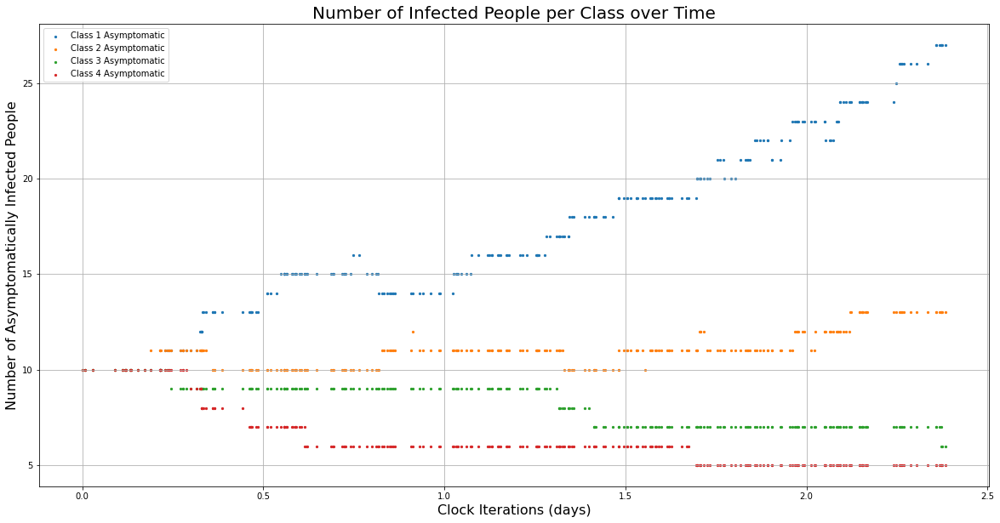

.. code:: ipython3

    import numpy as np
    import matplotlib.pyplot as plt
    from dynamics_model_4groups import dynamics_model

The Vaccine Allocation Problem
==============================

Description
-----------

Given a limited number of available vaccines and a population undergoing
an epidemic, how do we distribute vaccines to the population in a way
that achieves some goal (like minimizing death or maximizing the
potential for herd immunity)? The vaccine allocation or allotment
problem considers the question: If we divide the population into
different groups or risk classes, is there an *optimal* way to allocate
the vaccines across these groups so that we minimize infections, deaths
or hospitalizations? We approach this problem from a reinforcement
learning perspective.

4 Groups with Finite Action and Finite State Spaces
---------------------------------------------------

The file ``vacc_4groups.py`` contains an implemenation of an RL
environment for the vaccine allotment problem with 4 possible risk
groups, a finite action space, and a finite state space. In this
problem, we consider a scenario where the agent chooses a *priority
order* of the 4 risk groups. This means that vaccines are allocated in a
particular order until there are no more vaccines. In other words,
vaccines are given to eligbile recipients of priority group #1 until
there are no eligible recipients left or the vaccine supply is
exhausted. If there are vaccines left after all eligible people priority
group #1 are vaccinated, then priority group #2 can be vaccinated and so
on.

Reinforcement Learning Problem Setup
~~~~~~~~~~~~~~~~~~~~~~~~~~~~~~~~~~~~

**Markov Decision Process (MDP)**

At each time step :math:`t` in the RL environement, we have a population
of size :math:`P` split into four classes :math:`C_1^t, C_2^t, C_3^t`
and :math:`C_4^t`. Here, :math:`C_i^t` denotes the size of class
:math:`i` at time :math:`t`.

We further split each class :math:`C_i` into two groups: susceptbile
:math:`(S_i^t)` and asymptomatically infected :math:`(A_i^t)`. We keep
track of the aggregate totals of symptomatically infected individuals,
both mild (:math:`I^t`) and requiring hospitalization (:math:`H^t`).

For each time period :math:`t`, we also keep track of *new* infections
that have occurred since time step :math:`t-1`. We define this as

.. math::  N^t \equiv \left(I^{t} + H^{t} + \sum_{i=1}^{4} A_i^t\right) - \left(I^{t-1} + H^{t-1} + \sum_{i=1}^{4} A_i^{t-1}\right). 

\ In other words, we take the total number of infections at time
:math:`t` and subtract the total number of infections from time
:math:`t-1` to determine how many infections are *new*.

We form the MDP
:math:`(\mathcal{S}, \mathcal{A}, \mathcal{T}, \mathcal{R})` where + The
**state space** :math:`\mathcal{S}` is defined as
:math:`\mathcal{S} := [P]^{11}` with
:math:`[P] := \{0, 1, 2, \ldots, P\}`. Recall that :math:`P` is the
total population size. Each tuple in the space is of the form

.. math:: \left(S_1^t, S_2^t, S_3^t, S_4^t, A_1^t, A_2^t, A_3^t, A_4^t, I^t, H^t, N^t\right),

\ and thus tells us how many people are suceptible, infected and to
which group they belong (if applicable) at time step :math:`t`. + The
**action space** is defined by

.. math:: \mathcal{A} := \{a|a = \text{ a permutation of the numbers 1, 2, 3, 4} \quad \text{or} \quad a = \text{ an empty list }\}

where a permuation of :math:`\{1,2,3,4\}` defines a priority order of
the 4 classes and an empty list defines “no priority order,” aka random
vaccination. + The **transition dynamics** :math:`\mathcal{T}` are given
by the transitions in the continuous time Markov chain (CTMC) specified
below. > The state space of the CTMC is almost exactly the same as the
MDP. The state space in this case is also :math:`[P]^{11}`, but in this
case a state at a time :math:`t` is of the form

.. math:: \left(S_1^t, S_2^t, S_3^t, S_4^t, A_1^t, A_2^t, A_3^t, A_4^t, I^t, H^t, R^t\right).

The difference being that instead of the :math:`N^t` term in the state
space of the MDP, we have an :math:`R^t` term, where :math:`R^t` denotes
the number of recovered individuals at a given time :math:`t`. Recovered
individuals include anyone who has been vaccinated and anyone who has
recovered from infection. > > The initial state
:math:`(S_1^0, S_2^0, S_3^0, S_4^0, A_1^0, A_2^0, A_3^0, A_4^0, I^0, H^0, R^0)`
is specified as an initial condition by the user. > > All events in this
CTMC are implemented as independent Poisson processes. For example, the
times between meetings for all the groups (i.e. an interaction between
group :math:`i` and group :math:`j`) are given by Poisson processes with
rates specified by the user. In this case, we must specify a
:math:`4 \times 4` *contact* matrix :math:`\Lambda` where the
:math:`(i,j)`\ th component corresponds to the meeting rate between the
:math:`i`\ th and :math:`j`\ th groups. > > Only infectious meetings are
calculated, meaning we only keep track of meetings between infected
individuals and susceptible individuals. Each rate is a rate between two
people, so we have to scale the meeting rates by the number of people in
each class. This means that the rates change over time. Once a person in
class :math:`i` has been infected, they have probability :math:`p_i` of
developing symptoms. If a person in class :math:`i` develops symptoms,
they have probability :math:`h_i` of those symptoms requiring
hospitalization. > > There is also a recovery rate :math:`\beta` and a
vaccination rate :math:`\gamma`. The vaccination rate corresponds to the
average number of people that can be vaccinated per day and remains
constant. However, the recovery rate is scaled by the number of people
who are infected and thus changes over time. > > Each individual Poisson
process has an associated exponetial random variable “clock” with the
same rate as the Poisson process. This gives us a collection of
exponential timers. The minimum of several independent exponential
random variables is also an exponential random variable, but with a rate
equal to the sum of all the rates of the independent exponential random
variables. Therefore, to calculate the time of the next event, we sum up
the meeting, recovery, and vaccination rates and pass this sum as the
rate of an exponential random variable.

-  The **reward** (or *cost*, in this case) :math:`\mathcal{R}` recieved
   after transitioning from state :math:`s` to state :math:`s'` due to
   an action :math:`a` is equal to negative one times the total number
   of infections in state :math:`s'` minus the total number of
   infections at state :math:`s`, aka the new infections that occurred
   during this transition. If :math:`s = s_{t-1}` is the state at time
   :math:`t-1` and :math:`s' = s'_t` is the state at time :math:`t`,
   then :math:`\mathcal{R}_a(s,s') = -N^t`.

**Model Assumptions** The total population is kept constant throughout
the entire time horizon. There are precisely 4 risk classes, with the
first class corresponding to medical workers. Vaccines are administered
by priority group. The first priority group is vaccinated until there
are either no more eligible vaccination candidates or there are no more
vaccines. If vaccines remain, the next priority group is vaccinated and
so on. Asymptomatic individuals are never vaccinated. >For details about
the assumptions made in implementing the SIR disease dynamics model,
please refer to the section titled **Disease Dynamics** below.

**State Space**

The state space for this environment is discrete, consisting of tuples
of integer values representing certain population stats. > In this case,
an element of the state space looks like

.. math:: (S_1, S_2, S_3, S_4, A_1, A_2, A_3, A_4, I, H, N) \in \{0,1,2,...,\text{P}\}^{11}

\ where > + :math:`P =` the total population size > +
:math:`S_1,S_2,S_3,S_4 =` the total # of susceptible people in groups 1,
2, 3 and 4, resp > + :math:`A_1,A_2,A_3,A_4 =` the total # of
asymptomatically infected people in groups 1, 2, 3 and 4, resp > +
:math:`I =` total # of mild symptomatic infections > + :math:`H =` total
# of hospitalized infections and > + :math:`N =` total # of NEW
infections (includes asymptomatic and symptomatic) that occurred.

**Action Space**

The action space for this environment is finite, consisting of 25
possible actions. An action in this space is choosing a priority order.
A valid priority order is either (1) no priority order, aka vaccinate
susceptible people in the population randomly, or (2) a permuation of
:math:`\{1, 2, 3, 4\}`. > This is represented in ``vacc_4groups.py`` as
:math:`A =\{0, 1, 2, ..., 24\}`, where each number maps to a particular
action. In the file, an action is represented by a number
:math:`i \in A` where the corresponding action is at index :math:`i` of
the list ``all_priority_orders``. 0 corresponds to ``[]``, which means
no priority order. The list is below:

.. code:: ipython3

    all_priority_orders = [[], ["c1","c2","c3","c4"],["c2","c1","c3","c4"],["c3","c1","c2","c4"],["c1","c3","c2","c4"], ["c2","c3","c1","c4"],["c3","c2","c1","c4"],["c4","c2","c1","c3"],["c2","c4","c1","c3"], ["c1","c4","c2","c3"],["c4","c1","c2","c3"],["c2","c1","c4","c3"],["c1","c2","c4","c3"],["c1","c3","c4","c2"],["c3","c1","c4","c2"],["c4","c1","c3","c2"],["c1","c4","c3","c2"],["c3","c4","c1","c2"],["c4","c3","c1","c2"],["c4","c3","c2","c1"],["c3","c4","c2","c1"],["c2","c4","c3","c1"],["c4","c2","c3","c1"],["c3","c2","c4","c1"],["c2","c3","c4","c1"]]

**Reward**

The reward, or cost, is precisely equal to (negative) the number of
*new* infections that occurred in this step. By maximizing this
quantity, we minimize the number of new infections.

**Transitions**

Transistions between states are governed by the disease dynamics
implemented in ``dynamics_model_4groups.py`` file and described below
under the section **Disease Dynamics**. In short, the current state and
action are fed to the function ``dynamics_model`` imported from the
aforementioned file. This function then returns the new state as well as
some additional information that can be used to plot the population
dynamics.

**Environment**

The following functions are part of the RL environment implentation
found in the file ``vacc_4groups.py``. > ``init`` initializes an
instance of the VaccineEnvironment class; takes in a parameter
``config``, a dictionary of values used for different purposes
throughout the environment. The dictionary ``config`` should contain the
following keys and corresponding values: > + ``'eplen'``: number of time
steps > + ``'starting_state'``: np.array of initial population group
sizes, in the order described above under the **State Space** section.
Note that at index 10 we have :math:`N`, the number of new infections in
this time period. This should be set to 0 since new infections are
defined by the current state *and* a previous state. When we initialize,
there is no previous state. > + ``'parameters'``: dictionary of
parameter values to pass to dynamics model including information such as
contact rates, length of a time step (in days), starting priority order,
etc. More information about these can be found in the section titled
**Disease Dynamics** below, under the subsection **How to use
``dynamics_model_4groups.py``**.

.. code:: ipython3

    parameters = {'contact_matrix': np.array([[0.0001, 0.0001, 0.00003, 0.00003, 0, 0.0001], [0, 0.0001, 0.00005, 0.0001, 0, 0], [0, 0, 0.00003, 0.00003, 0, 0], [0, 0, 0, 0.00003, 0, 0]]), 'P': np.array([0.15, 0.15, 0.7, 0.2]), 'H': np.array([0.2, 0.2, 0.8, 0.3]), 'beta': 1/7, 'gamma': 100, 'vaccines': 500, 'priority': ["1", "2", "3", "4"], 'time_step': 7}
    
    initial_conditions = np.array([1990, 1990, 1990, 1990, 10, 10, 10, 10, 0, 0, 0])
    
    # example of what the config dictionary should look like
    config = {'epLen': 6, 'starting_state': initial_conditions, 'parameters': parameters}

   ``reset`` returns the environment to its original state

   ``step(action)`` takes an action from the agent and returns the state
   of the system after this action is taken + action: an integer between
   0 and 24 corresponding to the index of the ``all_priority_orders``
   list that corresponds to the chosen priority order; i.e. the action
   is found via ``all_priority_orders[action]`` > + e.g. “no priority
   order” would be action :math:`=0`, since
   ``all_priority_orders[0] = "[]"`` > +
   e.g. “:math:`C_1, C_2, C_3, C_4`” would be action :math:`=1` since
   ``all_priority_orders[1] = ["c1","c2","c3","c4"]"``

   The function ``step(action)`` returns + ``newState``: np.array of
   integers representing the new state (see state space description
   above) + ``reward``: integer value equal to the number of new
   infections that occurred in this step and multiplied by :math:`-1` +
   ``done``: either 0 or 1; flag for the end of the episode + ``info``:
   dictionary of information we can use to plot ``disease`` dynamics for
   this step

   ``render`` is currently unimplemented

   ``close`` is currently unimplemented

Disease Dynamics
~~~~~~~~~~~~~~~~

Consider a population of :math:`P` individuals split into four risk
classes: medical workers (:math:`C_1`), non-medical essential workers
(:math:`C_2`), high risk individuals (:math:`C_3`) and everyone else
(:math:`C_4`). Each risk class is further subdivided into five groups:
1. susceptible to the disease (but not infected) 2. asymptomatically
infected 3. infected with mild symptoms, 4. infected with severe
symptoms (assumed to require hospitalization) 5. recovered or vaccinated
or otherwise immune

We keep track of the susceptible people in each class :math:`(S_i)` and
the asymptomatically infected individuals in each class :math:`(A_i)`.
However, we only keep aggregate totals of people infected with mild
symptoms :math:`(I)`, people who are hospitalized :math:`(H)` and those
who have recovered :math:`(R)`.

**Assumptions**

In forming the SIR compartmental model, we have made the following
assumptions. 1. There are no births, deaths or immigration. 2. People
who are infected with mild symptoms perfectly quarantine, and hence do
no interact with others in the population. 3. People who are infected
with severe symptoms are hospitalized and only interact with medical
workers. 4. Vaccines are only administered to susceptible individuals
(i.e. infected or recovered individuals are ineligible). 5. Recovery is
permanent, i.e. once someone has recovered from infection they are
immune to infection.

**Model Details/Approach**

The model is implemented as a continuous time Markov chain, where events
such as infection, recovery and vaccination are modeled as independent
Poisson processes. > Contact, or meeting, rates within and between
classes are defined by a :math:`4 \times 4` matrix, where the
:math:`(i,j)`\ th entry is the contact rate between class :math:`i` and
class :math:`j`. We only account for infectious meetings, by which we
mean that when an infected person “contacts” a susceptible person, the
susceptible person will get infected. Hence, the contact rate is really
the rate of contact AND infection. Also, these meeting rates are the
rate between two people and hence must be scaled by the total number of
people in each group. As a consequence, these rates change over time. >
> People from class :math:`i` who are infected have probability
:math:`p_i` of that infection being symptomatic. If someone in class
:math:`i` is symptomatically infected, they have probability :math:`h_i`
of the symptoms being severe and thus requiring hospitalization. > > The
recovery rate :math:`\beta` is also scaled by the number of people that
are infected and hence changes over time. > The vaccination rate
:math:`\gamma` remains constant since the number of available vaccines
does not depend on the state of the Markov chain.

Note that the contact matrix :math:`\Lambda`, the probabilities
:math:`p_i` and :math:`h_i` for :math:`i=1,2,3,4`, the recovery rate
:math:`\beta`, and the vaccination rate must all be specified by the
user.

**How to use the ``dynamics_model_4groups.py`` file**

There are three functions inside this file, but the only one the user
ever needs to call is ``dynamics_model``, which takes the following
inputs: a dictionary called ``parameters`` and a numpy array called
``population``.

**Input**: a dictionary containing the following key and values >
``'contact_matrix'``: (np.array) contact rates matrix between
asymptomatic and susceptible people in classes (avg per day); should
have shape=() > > ``P``: (np.array) :math:`[p_1, p_2, p_3, p_4]`
probabilities of becoming symptomatic if infected for classes 1, 2, 3,
and 4, resp. > > ``H``: (np.array) :math:`[h_1, h_2, h_3, h_4]`
probabilities of being hospitalized if symptomatic for each class > >
``'gamma'``: (float) vaccination rate (average number of vaccines you
can administer per day) > > ``'beta'``: (float) recovery rate (per day)
> > ``'priority_order'``: list representing the priority order > >
``'vaccines'``: number of available vaccines (for one entire step in the
RL environment) > > ``'time_step'``: number of DAYS you want the
simulation to run (if time_step < 0, runs until disease-free state) > >
This is different from the the number of steps in the RL environment.
When you call ``dynamics_model``, it will run for however many “days”
you specify. So, for example, if one step in the environment translates
to taking an action, seeing what happens for one week and collecting the
reward at the end of the week, ``time_step`` would be set to 7. Then,
every step in the RL environment corresponds to one week in the disease
dynamics simulation.

**Input**: a numpy array of population group sizes > at index 0: the
current number of susceptible people in group 1 :math:`(S_1)` > > at
index 1: the current number of susceptible people in group 2
:math:`(S_2)` > > at index 2: the current number of susceptible people
in group 3 :math:`(S_3)` > > at index 3: the current number of
susceptible people in group 4 :math:`(S_4)` > > at index 4: the current
number of asymptomatically infected people in group 1 :math:`(A_1)` > >
at index 5: the current number of asymptomatically infected people in
group 2 :math:`(A_2)` > > at index 6: the current number of
asymptomatically infected people in group 3 :math:`(A_3)` > > at index
7: the current number of asymptomatically infected people in group 4
:math:`(A_4)` > > at index 8: the total number of people who are
symptomatic with mild symptoms :math:`(I)` > > at index 9: the total
number of people who are symptomatic with severe symptoms :math:`(H)` >
> at index 10: 0, technically a placeholder. Below are examples of both
these inputs.

.. code:: ipython3

    parameters = {'contact_matrix': np.array([[0.0001, 0.0001, 0.00003, 0.00003, 0, 0.0001], [0, 0.0001, 0.00005, 0.0001, 0, 0], [0, 0, 0.00003, 0.00003, 0, 0], [0, 0, 0, 0.00003, 0, 0]]), 'P': np.array([0.15, 0.15, 0.7, 0.2]), 'H': np.array([0.2, 0.2, 0.8, 0.3]), 'beta': 1/7, 'gamma': 100, 'vaccines': 500, 'priority': ["1", "2", "3", "4"], 'time_step': 2}
    population = np.array([1990, 1990, 1990, 1990, 10, 10, 10, 10, 0, 0,0])

The function ``dynamics_model`` outputs the (new) RL state at the end of
the simulation and some additional information that can be used to plot
the population dynamics that occurred in this step.

**Output**: ``newState`` is a numpy array with updated population
counts; > For information about what is in each index, look at the
description of the input ``population`` above. The only difference is
that now index 10 holds important information: the number of infections
that occurred during the simulation, aka “new infections” :math:`(N)`.

**Output**: ``output_dictionary`` is a dictionary with the following
keys (and values) that can be used to create plots of the disease
dynamics that occurred in this simulation > ``'clock times'``: array of
clock times over simulation > > ``'c1 asymptomatic'``: array of class 1
asymptomatic people for each clock time > > ``'c2 asymptomatic'``: array
of class 2 asymptomatic people for each clock time > >
``'c3 asymptomatic'``: array of class 3 asymptomatic people for each
clock time > > ``'c4 asymptomatic'``: array of class 4 asymptomatic
people for each clock time > > ``'mild symptomatic array'``: array of
aggregate mild symptomatic infections for each clock time > >
``'hospitalized array'``: array of aggregate hospitalized infections for
each clock time > > ``'c1 susceptible'``: array of class 1 susceptible
people for each clock time > > ``'c2 susceptible'``: array of class 2
susceptible people for each clock time > > ``'c3 susceptible'``: array
of class 3 susceptible people for each clock time > >
``'c4 susceptible'``: array of class 4 susceptible people for each clock
time > > ``'recovered'``: array of aggregate recovered people for each
clock time (will include symptomatic but not hospitalized) > >
``'total infected'``: total # of people infected by the end of the
simulation (includes people that were already infected) > >
``'total hospitalized'``: total # of people hospitalized throughout
simualation (includes people that were already hospitalized) > >
``'vaccines'``: # of vaccines left

.. code:: ipython3

    # example of a call to this function
    newState, info = dynamics_model(parameters, population)

.. parsed-literal::

     We've reached vaccination event number 0.0
     We've reached vaccination event number 100.0

.. code:: ipython3

    # example of the output newState
    newState

.. parsed-literal::

    array([1766, 1980, 1989, 1989,   27,   13,    6,    5,    1,    1,   36])

.. code:: ipython3

    # example of the keys in the output info
    print(info.keys())

.. parsed-literal::

    dict_keys(['clock times', 'c1 asymptomatic', 'c2 asymptomatic', 'c3 asymptomatic', 'c4 asymptomatic', 'mild symptomatic', 'hospitalized', 'c1 susceptible', 'c2 susceptible', 'c3 susceptible', 'c4 susceptible', 'recovered', 'total infected', 'total hospitalized', 'total recovered', 'vaccines', 'event counts'])

.. code:: ipython3

    # example of what you can plot using the info dictionary
    # adapted from code by Cornell University students Mohammad Kamil (mk848), Carrie Rucker (cmr284), Jacob Shusko (jws383), Kevin Van Vorst (kpv23)
    
    clocks = info['clock times']
    c1_A = info['c1 asymptomatic']
    c2_A = info['c2 asymptomatic']
    c3_A = info['c3 asymptomatic']
    c4_A = info['c4 asymptomatic']
    
    figsizex = 20
    figsizey = 10
    xlabelsize = 16
    ylabelsize = xlabelsize
    titlesize = 20
    
    %matplotlib inline
    
    fig = plt.figure(figsize=(figsizex,figsizey))
    ax1 = fig.add_subplot(111)
    
    ax1.scatter(clocks, c1_A, s=5, marker="o", label='Class 1 Asymptomatic')
    ax1.scatter(clocks, c2_A, s=5, marker="o", label='Class 2 Asymptomatic')
    ax1.scatter(clocks, c3_A, s=5, marker="o", label='Class 3 Asymptomatic')
    ax1.scatter(clocks, c4_A, s=5, marker="o", label='Class 4 Asymptomatic')
    plt.legend(loc='upper left');
    plt.ylabel('Number of Asymptomatically Infected People',size=ylabelsize)
    plt.xlabel('Clock Iterations (days)',size=xlabelsize)
    plt.title("Number of Infected People per Class over Time",size=titlesize)
    plt.grid(True)
    plt.show()

Heuristic Agents
~~~~~~~~~~~~~~~~

We currently have a single heuristic agent implemented. This algorithm
picks a fixed priority order over the different classes and allocates
according to that priority order.
